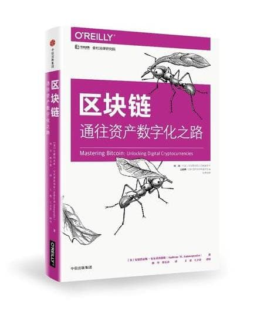

---
layout: cnpost
title: 比特币到底是什么？
date: 2019-08-30 22:00:00
categories: cn
tags: 计算机应用技术
--- 

__Contents__

* content
{:toc}

### 简介

本文是我于 2019 年 9 月 12 日在公司组织的一次有关比特币的分享。

最早我在 2015 年以小白的身份接触到比特币，那里面讳莫如深的知识（如挖矿机制、密码学）让人望而却步。如今，重读与比特币/区块链相关的书籍，觉得当年着实是被那些刻意拔高知识门槛的书籍骗了。

这篇关于比特币分享的最大的特点是从生活实际出发，探讨比特币存在的原因，并力求用尽可能简单的例子带你理解区块链到底长什么样子、挖矿机制是什么等等，相信你读完之后，再辅以自己的思考，会有所收获。

### 比特币的使命

好。首先我想先跟大家讨论一个问题：什么是比特币？

我想，很多人都不太清楚什么是比特币，我们对比特币的印象无非就是：
> 1. 比特币就是区块链
>
> 2. 区块链就是比特币
>
> 3. 割韭菜神器

大家都在把它当成一个新生事物来看待，我觉得这不太对。比特币解决的无非就是关于货币关于钱的问题，人类已经有四五千年的使用货币的历史了，如果说物理学这门学问人类还没有投入足够多优秀的大脑的话，那么关于钱的这门学问绝对是投入过剩了。关于钱的那些问题，我们已经研究的非常透彻了。人们都说太阳底下没有新鲜事儿，同样的，在钱这方面一定没，也没有什么新鲜事儿。

在我看来，比特币的理论基础，就是 **经济学 + 计算机科学**。即从传统的货币体系中提取了精华，又结合了日益成熟的计算机技术，例如密码学、分布式系统等等。它是这么一个物种。

比特币并不新鲜，其实我们在生活中就能体会到比特币的存在，我们来讲一个非常典型的经济链条：

> 前提：张三在苹果公司工作；
>
> 经济链条形如：张三把收入交给理财公司，理财公司用这些钱买入苹果公司的股票，苹果公司获得融资后抓紧生产，把 IPhone 卖给消费者，赚得一笔钱，并用这笔钱支付张三的工资。

看见没有，这样经济就 "运转" 起来了。为什么可以 "运转"呢？因为上面是一个闭环的经济模型，每一个人都参与其中，每一个人又都能获得收益。

在现实世界，这一点问题都没有，因为我们用的都是法币，法币就是法律规定无条件接受的货币，所以，如今你很难再看到有人拿着银两去买包子了 ：）

我们的交易非常依赖国家发行的法币，但是国家往往会因为各种各样的目的增发货币，最显著的例子就是 80 年代的 1 万块与现在的 1 万块的购买力完全不可同日而语，大家都有一个钱越来越毛了的感受，很可能就是这个原因。

因此，2008 年经济危机时，很多知识分子、仁人志士对政府滥发货币的行为看不下去了。其中有一个神秘的人物，没有人知道他到底是谁，他只在网络上出现，并只留下一个如雷贯耳的网名，叫做 "中本聪"。

他发表了几篇论文，探讨无政府认证的数字货币存在的可能性。

最终，他把数字货币这个项目落地，并取了一个好听的名字 -- 比特币。

所以，你明白了比特币的使命了吗？比特币要解决的就是中央银行滥发货币的问题，从中本聪的角度来说，他不信任任何中央权威，他希望货币守恒（货币数量不变），并且最重要的，他认为通过人民群众的参与就可以替代中央银行做的所有事情。

### 货币的共识机制

上回书说到，比特币的使命是干掉央行，实现人民民主专政。

我们暂且把央行比作蒋介石的领导班子吧。巧了，在万恶的国民党统治时期，蒋介石等一众人员亲手策划了极其恶劣的通货膨胀，最高面额达一百万一张，这也最终导致了当时中国金融市场、商品市场全面瘫痪。如果有兴趣，大家可以百科 "金圆券" 了解那一段历史。

请问，央行有什么作用？你思考一下再往下看。

以蒋介石领导的央行为例，它最大的作用就是拟定真钱的标准。从前人民用黄金、白银交易，但由于政府财政吃紧，蒋便下令实行币制改革，以金圆券强制取代黄金、白银，所有用黄金、白银交易的行为都被定性为非法，要坐牢，判刑。

再一个作用，央行手底下有几个小兄弟 -- 银行，央行负责造纸币、发行纸币，银行负责记账。民国时期的银行为当时的四大家族控制，此时如果政府打仗又缺钱了，便召集商界大佬开个会，总而言之，言而总之，是从你银行账户上划一些钱到我的名下，不知可否？

央行的权力实在是太大了，它给我们定义了一套体系，这套体系被写入法律中，成为我们的 "共识"。这样，我们拿着一百万金圆券去吃面，面馆老板才会承认。

但是如果没有央行，也就没有了这套体系、这套共识，这时候，你再拿着同样的一百万金圆券去吃面，面馆老板就不见得承认了，因为：

> 没有哪条标准告诉我这是钱
>
> 也没有谁能保证这张金圆券到我手上还能再花出去

什么是 "共识机制"，就是大家都认可、信任的一套体系，央行发行货币自带共识，国家、政府、暴力机器就是它的共识基础，但像比特币这样没有政府撑腰的货币，就要麻烦一些，它需要自建共识。

在一个没有中央权威的经济体系下，最迫切需要解决的问题就是“共识问题”，我们需要订规矩。

### 规矩一： 比特币要像银行一样记账 -- 区块链（账本）

比特币是超越地区、跨越国界的。现实中，每个国家都有各自的央行，每个国家的央行都要管理着好多商业性质的银行，每个银行又都有自己的一套账本，账本上事无巨细，记载着谁谁谁之间的交易，一般不会出差错。

比特币全世界就一套账本。无论你在中国、美国、加拿大，只要你在使用比特币，你就在使用同一套账本，并且，银行的账本普通人无权查阅，但比特币的账本，随便查，随便看。

我们以十分钟为一个交易区间，这十分钟的时间里，全比特币世界里会产生很多很多的交易，这些交易不会直接进入账本，好比你寄一封信，这封信不会直接寄向远方，你需要先把它放入信箱中，邮政人员每十分钟来取一次件，然后把这个件发出去。区块链的这个 "信箱" 比较大，里面存放的是这十分钟里比特币世界产生的所有的交易。

十分钟时间过去了，邮政人员到了，他把里面所有的交易数据打成一个压缩包，然后把这个压缩包放到区块链的账本里。直到这时，你的交易才真正的完成。

因此啊，在比特币世界，秒到账几乎是不可能的，因为他没有一个中央系统统一的处理这个事，同时为了保证账本的正确性，需要做时间上的牺牲。

就这样，每大约十分钟一个循环，每个循环产生一个数据包（每个数据包都包含近十分钟的所有交易数据），数据包与数据包与相连，事实上，我们称每个数据包为一个区块，区块与区块相连，就是区块链啦，就像 ...

### 规矩二： 比特币要像央行一样发行货币 -- UTXO（比特币）

好。我们现在已经有了一个公开的、可信赖的账本啦，我用一个例子来形容这个账本是怎么形成的：

> 你去老王家吃面条，给了他 1 个比特币，这个比特币当时并没有直接放入老王的口袋，而是放入一个巨大的交易池中，十分钟后，交易池中所有的交易被打包成为一个区块，放入区块链条中，此时，老王才真正拥有这枚比特币，而这个区块链条就是账本。

我相信你已经从宏观上了解到了比特币是怎么记账的，接下来我们从微观上剖析这笔交易，即你给了老王 1 个比特币，他怎么辨别这是不是真钱？他又是如何确认他一定还能花出去的呢？

两个字：查账。

每个人手上的比特币都一定有其源头，那么这个源头其实就记载在你的比特币上。

举个例子，假如公司发薪水 10 个比特币，当这 10 枚发到你手上的时候，他们身上就自带了一串信息：这些比特币来自于某某公司所发薪水。当你花其中的 1 枚比特币吃面的时候，面馆老板会看到你这 1 枚比特币来自于几月几号某某公司发的薪水，流水单号是多少，于是他去公开账本上去查是否存在该流水，查到了，我们就承认这笔钱是真的。

接着呢，不是转账，而是从你的账户里把那枚比特币删除，在面馆老板的账户添加一枚比特币，这样，你就不能把同一枚比特币花两次了，因为每一次花费比特币时，比特币系统都要去计算你口袋里所有未花费的比特币是多少，假如你有 0.9 个未花费的比特币却非要购买 1 个比特币的商品，啊～我也无能为力啊。

UTXO 的英文是 Unspent Transaction Output,中文译为未花费的交易输出。事实上，这才是真真正正、实实在在能花的比特币。每次交易前，比特币系统计算的是你有没有足够的 UTXO，交易时，你花费的是 UTXO，交易后，你少了的，也是 UTXO。比特币，就是 UTXO。

### 规矩三： 比特币要依靠群众合法取代银行和央行 -- PoW（矿工）

你看，我们账本有了，交易的比特币（UTXO）有了，还缺什么？

我提示你一下，我们交易的过程是先把交易放在交易池中，并不是直接转账对吗？然后呢？每大概十分钟就会有人来清空交易池，把交易打包，放到账本中。

发现了吗？有人来做交易打包的事情，那这个人，会是谁呢？

首先我们来达成一个共识，就是交易打包这个事情，非同小可，对不对？你想想，十分钟内所有的交易哎，big money,hah?

我们来做个假设，假如你是一个大老板，现在有一件非常非常重要的事情要交给你的手下去做，比如要去存 1000 万现金，你会选择谁去做呢？说白了，谁最值得信任呢？

我不知道你的答案，根据我的本能，我一定选择诚实的、本领高的、能力强的。

比特币世界也是这样，打包交易这件事情非常重要，不能随便一个阿猫阿狗就来干这件事，那我就出一道难题，谁先解开，这个打包交易的任务就交给谁。同时呢，为了防止这个人在打包交易的时候捣鬼，比如说我交给你去银行存现金 1000 万，你最后存了 900 万，剩下 100 万私吞了，那可不行。我要求你干完这件事情后，还要告诉你的所有同事，接受你所有同事的监督，一旦有超过 51% 的同事认为你的任务圆满完成，那我就把你打包的数据放到区块链中，供全网人查看、使用。同时，为了表示对你工作的肯定，我还给予你 12.5 枚比特币，以资鼓励。但是，一旦你被查到贪污了，不仅你之前做的工作作废，12.5 个比特币也不给你了。中本聪说：反正你看着办。

### 总结

到这儿，关于比特币基本的流程、概念、远离，我们就讲完了。我们再来回顾一下。

比特币解决的问题就是在没有一个中央权威的情况下，有一个大家公认的机制，来让每一笔钱正确无误的运转。所以在设计系统的时候，就设计出了三个共识。

> 第一：账本全部公开；
> 第二：有了前面的公开账本上我就可以查到你的这笔钱到底合不合法，也就是说请告诉我钱哪儿来的？
> 第三：有人自发的维护区块链条的运转;当然了，这个维护不是志愿的，而是有报酬的。

那么，基于以上三点，整个的去中心化的经济世界，就运转起来了。

我不建议你去 "炒" 币，你去为它而疯狂。你看到了，我还专门为 "炒" 字加了引号，这是种不健康的、急功近利的心态，这种心态往往让你适得其反。包括 "炒" 股。

但我建议你学习它，你抱着一种谦虚的、谨慎的、求学的心态对待它，对待一种市场上、技术上出来的所谓的 "新物种"，这是个学习的机会，同时也是考验你认知的机会。

比特币会有未来吗？我不知道，到现在为止，我也只是知道，比特币并不神奇，我们现实生活中的货币体系就像戴着镣铐、老实巴交的小家伙，而比特币，更像是不安分的大猩猩，它左冲右撞，尝试着突破局限。但是呢，它本质并没有什么区别，都是经济学，只是处理人与人之间信任的手段稍有不同罢了，一个是通过权威，另一个是计算机技术去防范不值得信任的人。

通过权威解决问题的，效率高，但中央集权，会有很多内部问题；通过技术解决问题的，内部往往没多大问题，但会导致很多的电能、计算性能等资源白白浪费。

孰好孰坏，谁知道呢？

附：

以上关于比特币的相关见解和思考，多来自于对下面这本书的提炼：

如果你对经济学感兴趣，有一本书也可以推荐给你，作者是一位备受争议的老人、一个经济学家：

好，谢谢大家。